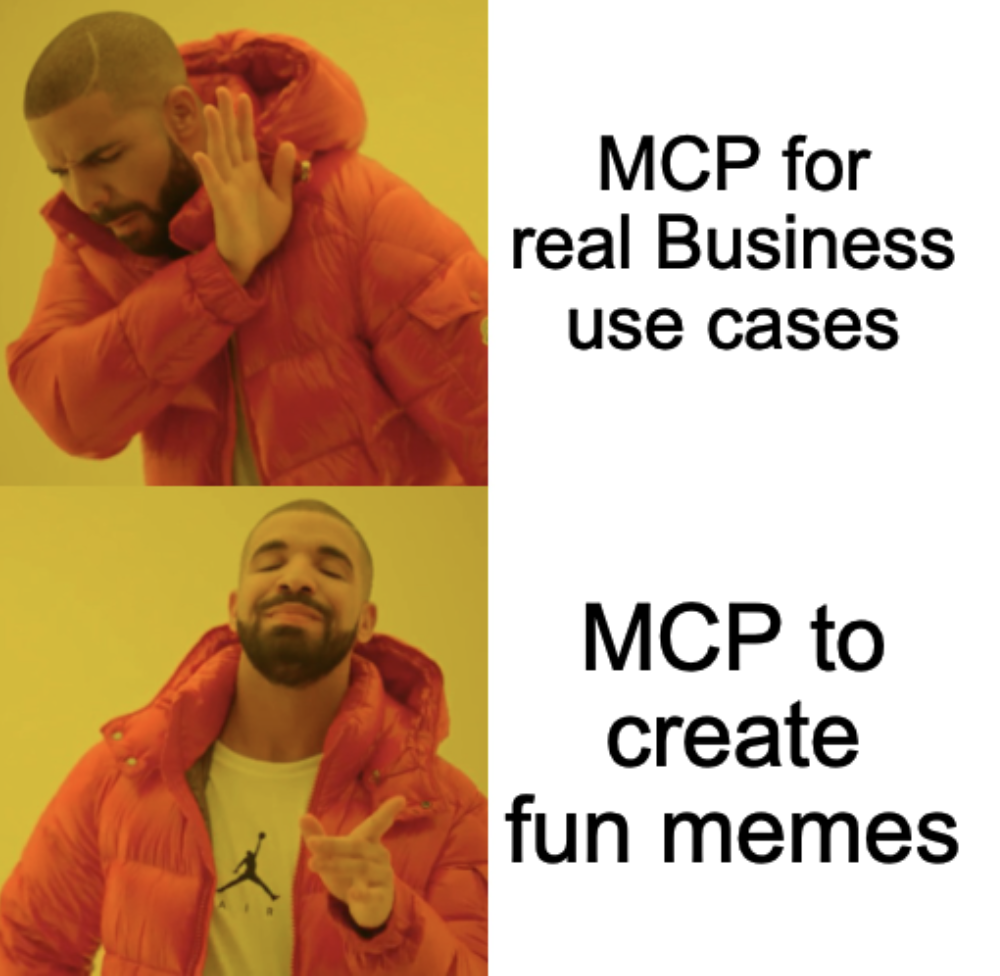

# imgflip-mcp

[](https://github.com/mariokernich/imgflip-mcp/actions/workflows/ci.yml)
[](https://www.npmjs.com/package/imgflip-mcp)
[](LICENSE)
[](https://insiders.vscode.dev/redirect?url=vscode%3Amcp%2Finstall%3F%7B%22name%22%3A%22imgflip%22%2C%22command%22%3A%22npx%22%2C%22args%22%3A%5B%22-y%22%2C%22imgflip-mcp%22%5D%2C%22env%22%3A%7B%22IMGFLIP_USERNAME%22%3A%22%24%7Binput%3Aimgflip_username%7D%22%2C%22IMGFLIP_PASSWORD%22%3A%22%24%7Binput%3Aimgflip_password%7D%22%7D%2C%22inputs%22%3A%5B%7B%22id%22%3A%22imgflip_username%22%2C%22type%22%3A%22promptString%22%2C%22description%22%3A%22Imgflip%20username%22%7D%2C%7B%22id%22%3A%22imgflip_password%22%2C%22type%22%3A%22promptString%22%2C%22description%22%3A%22Imgflip%20password%22%2C%22password%22%3Atrue%7D%5D%7D)

**📚 Full documentation: [mariokernich.github.io/imgflip-mcp](https://mariokernich.github.io/imgflip-mcp/)**

There's an MCP server for your database. One for your Kubernetes cluster. One for your cloud bill, one for your ticket system, and at least twelve for reading PDFs. Serious servers for serious work.

But somewhere along the way, the ecosystem forgot the workload that actually keeps engineering teams running: **memes**.

`imgflip-mcp` closes that gap. It's a [Model Context Protocol](https://modelcontextprotocol.io) server for the [Imgflip meme generator API](https://imgflip.com/api), so Claude (or any other MCP client) can browse thousands of meme templates and caption them mid-conversation — turning your AI assistant into the coworker who always has the right reaction image.

<p align="center">
  <br>
  <em>This meme was, of course, generated by imgflip-mcp itself.</em>
</p>

> **You:** *"Make me a Drake meme about writing tests vs. testing in production"*
> **Claude:** 🖼️ *calls `get_memes` → calls `caption_image` → sends you the image link*

Everything you need is a **free Imgflip account**. An Imgflip API Premium subscription is **optional** — it unlocks five extra tools (search, GIF captioning, automeme, AI memes), which stay hidden unless you explicitly enable them.

## What would I even use this for?

More than you'd think. Once meme generation is one sentence away, it sneaks into real workflows:

- **Docs people actually finish reading.** Let Claude write your README section and cap it with a fitting meme — retention engineering at its finest.
- **Release notes with a punchline.** "v2.0: we rewrote everything" hits different next to an *Expanding Brain* meme of your migration steps.
- **Code review, but kind.** Answer the 400-line PR with a *Two Buttons* meme instead of a lecture. Same message, fewer hurt feelings.
- **Retros & standups.** Feed in the sprint summary, get the *This Is Fine* recap the team deserves.
- **Incident postmortems.** Nothing says "blameless" like a well-chosen *Disaster Girl* on the last slide.
- **Slack announcements.** Deploy freezes, on-call handovers, "the build is green again" — all measurably more effective as memes.

Is any of this *necessary*? No. Neither is syntax highlighting, and yet here we are.

## Tools

### Free tools (enabled by default)

| Tool | Description | Imgflip endpoint | Requirements |
| --- | --- | --- | --- |
| `get_memes` | List the ~100 most popular meme templates, with optional name filtering | `GET /get_memes` | none |
| `caption_image` | Caption a template and get the generated image URL | `POST /caption_image` | free Imgflip account |

These two tools cover the everyday use case end to end: find a template, put text on it, get the image URL.

### Premium tools (optional, opt-in)

| Tool | Description | Imgflip endpoint |
| --- | --- | --- |
| `search_memes` | Search 1M+ templates by name | `POST /search_memes` |
| `get_meme` | Look up a single template by id | `POST /get_meme` |
| `caption_gif` | Caption an animated GIF template | `POST /caption_gif` |
| `automeme` | Auto-pick a template for a piece of text | `POST /automeme` |
| `ai_meme` | Let Imgflip's AI invent a whole meme | `POST /ai_meme` |

These require an [Imgflip API Premium subscription](https://imgflip.com/api_upgrade) and are **not registered by default**, so free-tier users never see tools that would fail. If you have Premium, enable them by setting `IMGFLIP_PREMIUM=true`.

### Extras

- **Inline images:** every meme-generating tool returns the result both as URL *and* as an embedded image (up to 2 MB), so clients like Claude Desktop render the meme directly in the chat.
- **`make-meme` prompt:** an MCP prompt that guides the model through template selection and captioning — pass a `topic` and optionally a `template` preference.
- **Tool annotations:** lookup tools are marked `readOnlyHint` so clients can auto-approve them safely.

## Prerequisites

- **Node.js 22+**
- An **Imgflip account** ([sign up for free](https://imgflip.com/signup)) — required for every tool except `get_memes`

### Environment variables

| Variable | Required | Description |
| --- | --- | --- |
| `IMGFLIP_USERNAME` | yes* | Your Imgflip username |
| `IMGFLIP_PASSWORD` | yes* | Your Imgflip password |
| `IMGFLIP_PREMIUM` | no | Set to `true` to also register the five Premium tools (default: off) |

\* Only `get_memes` works without credentials.

> **Note:** The Imgflip API authenticates with username/password form fields — it does not offer API keys. Consider creating a dedicated Imgflip account for API use.

## Installation

The server communicates over **stdio**, so your MCP client launches it as a subprocess — there is no port or daemon to manage. Pick whichever route fits your client:

| Route | Best for | How |
| --- | --- | --- |
| **Desktop Extension (`.mcpb`)** | Claude Desktop | download from [Releases](https://github.com/mariokernich/imgflip-mcp/releases), double-click, fill in the credentials form — [guide](https://mariokernich.github.io/imgflip-mcp/install/claude-desktop/) |
| **Claude Code plugin** | Claude Code | `/plugin marketplace add mariokernich/imgflip-mcp`, then `/plugin install imgflip@imgflip-mcp` — [guide](https://mariokernich.github.io/imgflip-mcp/install/claude-code/) |
| **VS Code button** | Copilot users | click the *Install in VS Code* badge above — [guide](https://mariokernich.github.io/imgflip-mcp/install/vscode-copilot/) |
| **npx** | any other client | command `npx`, args `["-y", "imgflip-mcp"]` — [guide](https://mariokernich.github.io/imgflip-mcp/install/other-clients/) |

Every client uses the same shape. For example, in Claude Desktop's `claude_desktop_config.json` or Cursor's `.cursor/mcp.json`:

```json
{
  "mcpServers": {
    "imgflip": {
      "command": "npx",
      "args": ["-y", "imgflip-mcp"],
      "env": {
        "IMGFLIP_USERNAME": "your-username",
        "IMGFLIP_PASSWORD": "your-password"
      }
    }
  }
}
```

Or for Claude Code in one line:

```bash
claude mcp add imgflip \
  --env IMGFLIP_USERNAME=your-username \
  --env IMGFLIP_PASSWORD=your-password \
  -- npx -y imgflip-mcp
```

Add `IMGFLIP_PREMIUM=true` to the environment if you have API Premium. Then just ask:

> *"Make a Drake meme: top 'manually formatting code', bottom 'letting the linter do it'."*

## Documentation

Everything beyond the basics lives on the **[documentation site](https://mariokernich.github.io/imgflip-mcp/)**:

- **[Quickstart](https://mariokernich.github.io/imgflip-mcp/quickstart/)** — from zero to first meme in five minutes
- **[Creating memes](https://mariokernich.github.io/imgflip-mcp/creating-memes/)** — the two-step workflow, multi-box templates, positioning, colors and fonts
- **[Tools reference](https://mariokernich.github.io/imgflip-mcp/tools/)** — every tool, parameter and response
- **[Configuration](https://mariokernich.github.io/imgflip-mcp/configuration/)** and **[Premium tools](https://mariokernich.github.io/imgflip-mcp/premium/)**
- **[FAQ & troubleshooting](https://mariokernich.github.io/imgflip-mcp/faq/)** — missing credentials, links without images, tools not showing up, …
- **[Local development](https://mariokernich.github.io/imgflip-mcp/development/)**, **[architecture](https://mariokernich.github.io/imgflip-mcp/architecture/)** and **[publishing](https://mariokernich.github.io/imgflip-mcp/publishing/)**

## Privacy

This server runs locally and is stateless: your Imgflip credentials and meme texts are sent exclusively to `https://api.imgflip.com` (which requires them for authentication and generation), and nothing is logged, stored, or sent anywhere else. Generated memes are hosted **publicly** on imgflip.com. Details in [PRIVACY.md](PRIVACY.md); Imgflip's own handling is covered by the [Imgflip privacy policy](https://imgflip.com/privacy).

## Contributing

Contributions are welcome — see [CONTRIBUTING.md](CONTRIBUTING.md) for the guidelines and [CHANGELOG.md](CHANGELOG.md) for release history. Something broken? [Open an issue](https://github.com/mariokernich/imgflip-mcp/issues) — ideally with the tool call that failed and your client.

This is an independent community project, not affiliated with Imgflip.

## License

[MIT](LICENSE)
