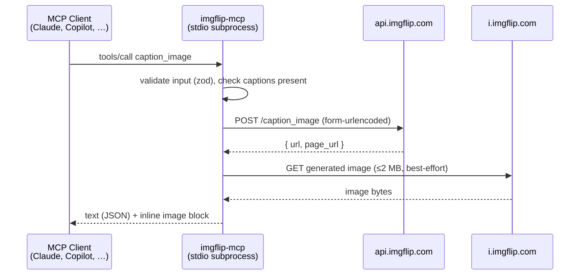

# Architecture

Deliberately small: three source files, no state, no magic.

```
src/
  index.ts    MCP server — tool/prompt registration, stdio transport
  client.ts   Typed client for the Imgflip REST API
  types.ts    Shared type definitions for API payloads
```

## Request flow



## Design decisions

**Thin, faithful API mapping.** Tool names and parameters mirror the Imgflip endpoints one-to-one. Anyone who has read [imgflip.com/api](https://imgflip.com/api) knows this server, and vice versa.

**Premium is opt-in at registration time.** Rather than exposing seven tools and letting five of them fail on free accounts, the server registers Premium tools only when `IMGFLIP_PREMIUM=true`. Clients see a tool list that is guaranteed to work.

**Errors are data, not crashes.** Every Imgflip failure (API error message, HTTP error, timeout, missing credentials) becomes a readable `isError` tool result. The model can react — retry, rephrase, tell the user — instead of the server dying.

**Image embedding is best-effort.** The generated meme is downloaded and attached as an inline MCP image block when it's ≤2 MB and the download succeeds; otherwise the URL alone is returned. A slow CDN never fails a meme.

**Stateless by construction.** No cache, no disk writes, no sessions. Every tool call is independent, which keeps the security story one sentence long: credentials in, HTTPS to Imgflip, nothing retained.

## Key implementation details

- **Transport:** stdio via `@modelcontextprotocol/sdk` (`McpServer` + `StdioServerTransport`)
- **Validation:** zod schemas per tool; the SDK converts them to JSON Schema for clients
- **HTTP:** native `fetch` (Node ≥ 18) with a 30 s `AbortSignal.timeout`
- **Form encoding:** `URLSearchParams`, including Imgflip's `boxes[i][field]` array convention
- **Version:** read from `package.json` at runtime — single source, synced to all metadata files by `scripts/sync-versions.mjs`
