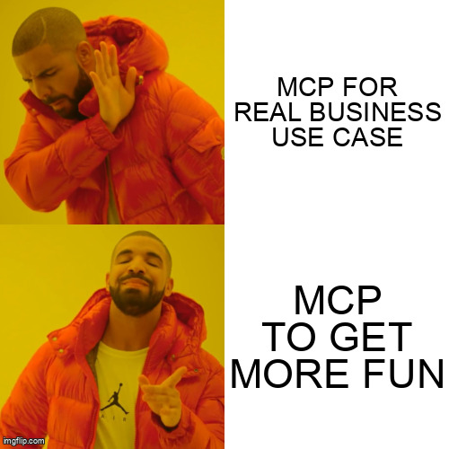

# imgflip-mcp

**The MCP server for the workload that actually keeps engineering teams running: memes.**

There's an MCP server for your database, your Kubernetes cluster, your cloud bill — serious servers for serious work. `imgflip-mcp` covers the gap they all left open: it connects Claude (or any MCP client) to the [Imgflip meme generator API](https://imgflip.com/api), so your AI assistant can browse thousands of meme templates and caption them mid-conversation.

   
  <em>This meme was, of course, generated by imgflip-mcp itself.</em>

> **You:** *"Make me a Drake meme about writing tests vs. testing in production"*
> **Claude:** 🖼️ *calls `get_memes` → calls `caption_image` → shows you the finished meme*

## Highlights

- **Free tier first** — a free Imgflip account covers the full core workflow. The five [Premium tools](premium.md) are opt-in and hidden by default.
- **Inline results** — generated memes come back as embedded images, not just links, so clients like Claude Desktop render them right in the chat.
- **Every client** — Claude Desktop (one-click `.mcpb` extension), Claude Code (built-in plugin marketplace), VS Code/Copilot (install button), Cursor and any other stdio MCP client.
- **Boring where it counts** — strict TypeScript, full test suite, CI, typed API client, sensible errors. The jokes are in the memes, not the codebase.

## Where to start

| I want to… | Go to |
| --- | --- |
| Create my first meme in 5 minutes | [Quickstart](quickstart.md) |
| Set it up in my client | [Installation](install/claude-desktop.md) |
| See every tool and parameter | [Tools Reference](tools.md) |
| Understand multi-box templates & styling | [Creating Memes](creating-memes.md) |
| Get inspired | [Use Cases & Ideas](use-cases.md) |
| Fix a problem | [FAQ & Troubleshooting](faq.md) |

!!! info "Not affiliated with Imgflip"
    This is an independent community project built on Imgflip's public API. Generated memes are hosted publicly on imgflip.com — see [Privacy](privacy.md).
